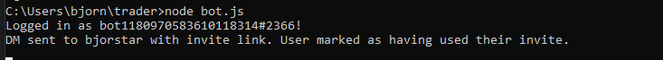
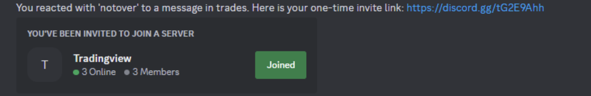

# Discord Invite Bot README

This Discord bot is designed to listen for reactions on messages within a Discord server. When a user reacts to a message with a specific emoji, the bot creates a one-time, non-expiring invite link to the server and sends it to the user via direct message (DM). Purposed for an exclusive community of traders on discord where all members can invite excactly one other person to join.

## Features

- **Invite Creation**: Automatically creates a one-time, non-expiring invite link for users who react with the specified emoji.
- **DM Invites**: Sends the invite link directly to the user's DMs.
- **Invite Tracking**: Keeps track of which users have already received an invite to prevent spamming.

## Requirements

- Node.js
- `discord.js` library

## Setup

1. **Install Dependencies**: Run `npm install` to install required dependencies.
2. **Configuration**:
   - Set the `myToken` variable in the code to your Discord Bot Token.
3. **Running the Bot**: Use `node yourScriptName.js` to start the bot.

## Usage

- The bot starts listening for reactions using the specified emoji to a message posted by the bot in a read-only channel. 
- When a user reacts with the target emoji to any message, the bot checks if the user has already used an invite.
- If not, the bot creates a new invite link and sends it to the user via DM, marking the user as having received an invite.
- 

## Note

- Ensure the bot has permission to create invites and send DMs to users.
- The bot uses partials to handle messages, channels, reactions, and users that may not be cached.

## Contributing

Contributions are welcome. Please open an issue or pull request if you have suggestions or improvements.

## License

This project is open-source and available under the [MIT License](https://opensource.org/licenses/MIT).
